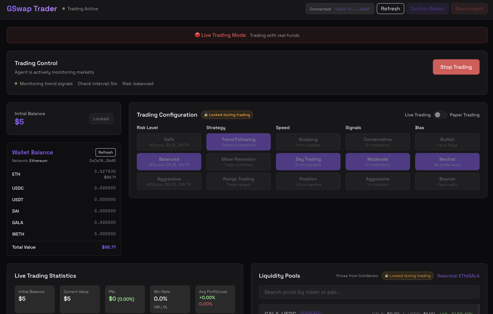

#  GSwap Trader

<div align="center">


**AI-Assisted Trading Companion for GSwap DEX**



[](LICENSE)
[](https://kit.svelte.dev/)
[](https://www.typescriptlang.org/)
[](https://tailwindcss.com/)
[](https://platform.openai.com/)

</div>

## 🎯 Overview

GSwap Trader is an intelligent automated trading agent for the GSwap decentralized exchange. It combines advanced trading strategies with real-time market analysis to execute trades 24/7, now enhanced with an AI assistant powered by GPT-4 Turbo.

## 🤖 AI Chat Assistant (NEW!)

**Powered by GPT-4 Turbo** - Get intelligent trading assistance with our built-in AI chat:

### Chat Features
- **💬 Natural Language Interaction** - Ask questions about trading strategies and market conditions
- **🎯 Smart Commands** - Control your bot with slash commands:
  - `/start` - Begin automated trading
  - `/stop` - Pause trading operations
  - `/stats` - View performance metrics
  - `/balance` - Check wallet balances
  - `/config` - Review current settings
  - `/risk <level>` - Adjust risk profile
  - `/strategy <type>` - Change trading strategy
  - `/paper <on/off>` - Toggle paper trading
- **📊 Market Analysis** - Get real-time insights on GALA, GWETH, and GUSDC pairs
- **💡 Strategy Recommendations** - Receive personalized trading advice
- **⚡ Quick Actions** - One-click buttons for common operations

## ✨ Features

### 🎮 Trading Modes
- **📝 Paper Trading** - Practice with virtual funds ($500 default)
- **💰 Live Trading** - Trade with real funds via MetaMask
- **🔄 Seamless Switching** - Toggle between modes anytime

### 📊 Trading Strategies
- **📈 Trend Following** - Ride the momentum with SMA crossovers
- **🔄 Mean Reversion** - Trade market extremes with Bollinger Bands
- **📏 Range Trading** - Profit from support/resistance levels

### ⚙️ Risk Profiles
- **🛡️ Safe** - Conservative approach (15% position, 3% stop loss)
- **⚖️ Balanced** - Moderate risk/reward (30% position, 5% stop loss)
- **🚀 Aggressive** - High risk/reward (60% position, 15% stop loss)

### 🌐 Real-Time Features
- **💹 Live Prices** - CoinGecko integration for real-time token prices
- **🦊 MetaMask Integration** - Secure wallet connection
- **📱 Toast Notifications** - Real-time trading alerts
- **📈 Live Statistics** - Track P&L, win rate, and performance
- **🔍 Pool Search** - Find and select trading pairs easily

### 🎨 User Interface
- **🌙 Dark Theme** - Easy on the eyes for extended trading sessions
- **✨ Glassmorphic Design** - Modern, sleek interface
- **📱 Responsive Layout** - Works on all devices
- **🔒 Trading Lockdown** - Prevents config changes during active trading

## 🚀 Quick Start

### Prerequisites
- Node.js 18+ and npm
- MetaMask browser extension (or private key for automatic trading)
- Some crypto for trading (or use paper trading mode)

### Installation

```bash
# Clone the repository
git clone https://github.com/jonasrmichel/gswap-trader.git
cd gswap-trader

# Install dependencies
npm install

# Copy environment variables
cp .env.example .env

# Start the development server
npm run dev
```

### 🤖 Automatic Trading Setup (No Wallet Approval Needed)

To enable fully automatic trading without MetaMask approval prompts:

1. **Create a dedicated trading wallet** (for security)
2. **Export the private key** from your wallet
3. **Add to `.env` file:**
   ```bash
   VITE_WALLET_PRIVATE_KEY=your_private_key_here
   ```
4. **Restart the app** - it will auto-connect using the private key

⚠️ **Security Notes:**
- Never share your private key
- Use a separate wallet for trading with limited funds
- The `.env` file is gitignored for safety
- Consider using a hardware wallet for large amounts

The app will be available at `http://localhost:4000`

### Production Build

```bash
# Build for production
npm run build

# Preview production build
npm run preview
```

## 🎮 How to Use

### 1. Connect Your Wallet
Click "Connect Wallet" and choose MetaMask or enter a private key (for testing only).

### 2. Configure Your Strategy
- **Risk Level**: Choose safe, balanced, or aggressive
- **Strategy**: Select trend following, mean reversion, or range trading
- **Speed**: Set trading frequency (1min, 5min, or 1hr candles)
- **Signals**: Configure indicator sensitivity
- **Market Bias**: Set bullish, neutral, or bearish outlook

### 3. Select a Trading Pair
Browse available liquidity pools and select your preferred trading pair. Popular pairs include:
- GALA/USDC
- ETH/USDT
- BNB/USDC

### 4. Start Trading
Click "Start Trading" to begin automated trading. The agent will:
- Monitor selected pools for opportunities
- Execute trades based on your configuration
- Track performance in real-time
- Display logs of all activities

## 📊 Trading Parameters

| Risk Level | Position Size | Stop Loss | Take Profit | Trailing Stop |
|------------|--------------|-----------|-------------|---------------|
| Safe       | 15%          | 3%        | 2%          | Disabled      |
| Balanced   | 30%          | 5%        | 4%          | Optional      |
| Aggressive | 60%          | 15%       | 10%         | Enabled       |

## 🛠️ Technology Stack

- **Frontend**: SvelteKit 2.0 + TypeScript
- **Styling**: Tailwind CSS + Custom Glassmorphism
- **Blockchain**: ethers.js v6 + GalaChain SDK
- **Price Data**: CoinGecko API
- **State Management**: Svelte Stores
- **Notifications**: Custom Toast System

## 📁 Project Structure

```
gswap-trader/
├── src/
│   ├── lib/
│   │   ├── components/    # UI components
│   │   ├── gswap/         # GSwap integration
│   │   ├── services/      # External services
│   │   ├── stores/        # State management
│   │   ├── trading/       # Trading logic
│   │   └── wallet/        # Wallet management
│   ├── routes/            # SvelteKit pages
│   └── app.css           # Global styles
├── static/               # Static assets
└── package.json         # Dependencies
```

## 🔒 Security

- Never share your private keys
- Always verify contract addresses
- Start with paper trading to test strategies
- Use appropriate position sizing for your risk tolerance
- Monitor your trades regularly

## 🤝 Contributing

Contributions are welcome! Please feel free to submit a Pull Request.

1. Fork the repository
2. Create your feature branch (`git checkout -b feature/AmazingFeature`)
3. Commit your changes (`git commit -m 'Add some AmazingFeature'`)
4. Push to the branch (`git push origin feature/AmazingFeature`)
5. Open a Pull Request

## 📜 License

Copyright 2025 Jonas Michel

Licensed under the Apache License, Version 2.0 (the "License");
you may not use this file except in compliance with the License.
You may obtain a copy of the License at

    http://www.apache.org/licenses/LICENSE-2.0

Unless required by applicable law or agreed to in writing, software
distributed under the License is distributed on an "AS IS" BASIS,
WITHOUT WARRANTIES OR CONDITIONS OF ANY KIND, either express or implied.
See the License for the specific language governing permissions and
limitations under the License.

## ⚠️ Disclaimer

This software is for educational purposes only. Cryptocurrency trading carries significant risk. Never trade with funds you cannot afford to lose. The developers are not responsible for any financial losses incurred through the use of this software.

## 🙏 Acknowledgments

- [GalaChain](https://gala.com/) for the blockchain infrastructure
- [CoinGecko](https://www.coingecko.com/) for price data
- [Freqtrade](https://www.freqtrade.io/) for trading strategy inspiration
- [SvelteKit](https://kit.svelte.dev/) for the amazing framework
- Built with [Tailwind CSS](https://tailwindcss.com/)
- Web3 integration via [ethers.js](https://docs.ethers.io/)

---

<div align="center">

**Built with ❤️ by traders, for traders**

[🌟 Star us on GitHub](https://github.com/jonasrmichel/gswap-trader)

</div>